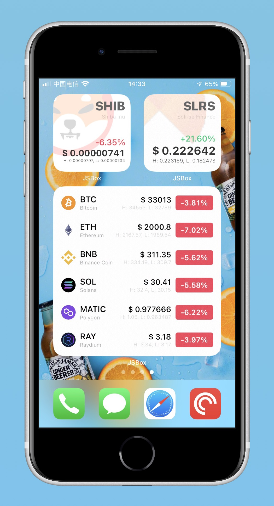
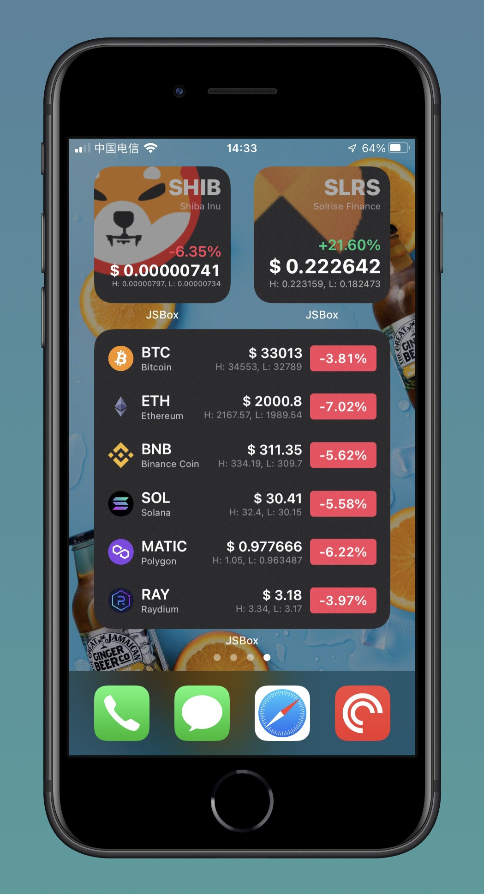

# PriceWidgets

## 简介
一个 [JSBox](https://github.com/cyanzhong/xTeko) 小组件。iOS桌面小组件，展示关注的虚拟货币价格等信息。

已在 [Erots](https://github.com/LiuGuoGY/JSBox-addins) 商店上架。

## Usage

！！！ 请首先在主应用内运行一次，用以更新货币的基本数据。！！！

后期如果想关注的某个货币没有价格数据，也可以在主应用内运行一次，也许就有了呢～


「输入参数」为关注的token符号列表，以半角逗号「,」分隔，不区分大小写。例如：
```
BTC,Eth,bnb
```
2x2尺寸的小组件仅支持单个token，4x2尺寸最多展示3个，4x4尺寸最多展示6个。如果想关注更多，就用智能堆叠功能呗。

## Screenshots



